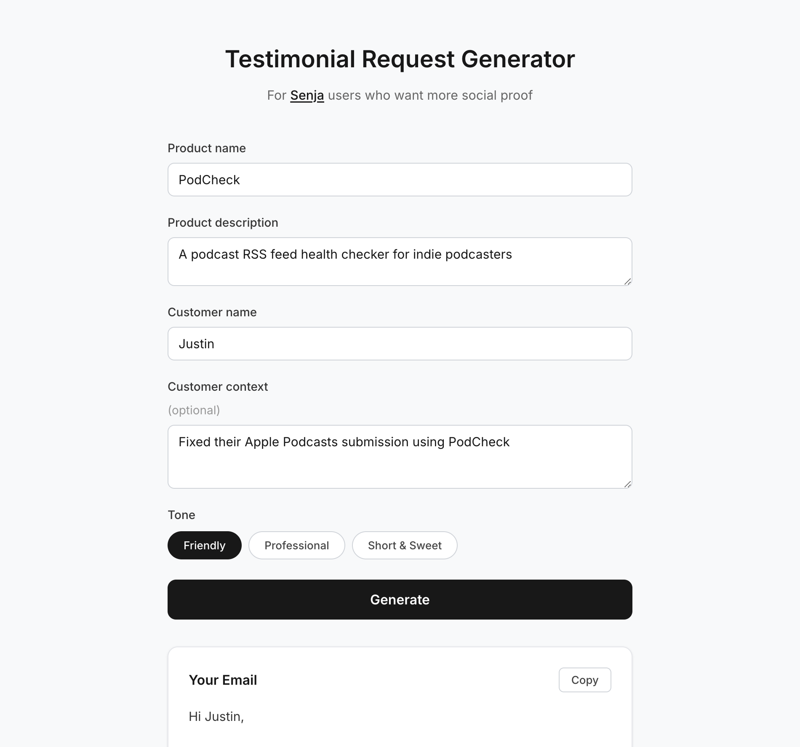

# Testimonial Request Generator

Testimonial request email generator for Senja users — paste your product info and a customer's name, get a personalised, non-pushy email ready to send.

Built for [Senja](https://senja.io) users who want more social proof but struggle to ask without sounding awkward.

---



---

## Stack

- **SvelteKit** — frontend UI
- **Node.js + Express** — single-endpoint backend
- **Anthropic Claude** — email generation via direct API fetch
- **Vercel** — frontend deployment
- **Railway** — backend deployment

---

## Features

- Three tones: Friendly, Professional, Short & Sweet
- Optional customer context for personalised emails
- Copy to clipboard with one click
- Regenerate for a different result
- Clean, mobile-responsive design

---

## Local Setup

### Prerequisites

- Node.js 18+
- An [Anthropic API key](https://console.anthropic.com/)

### Backend

```bash
cd backend
npm install
```

Create a `.env` file:

```
ANTHROPIC_API_KEY=your_key_here
PORT=3000
```

Start the server:

```bash
node server.js
```

The backend runs at `http://localhost:3000`.

### Frontend

```bash
cd frontend
npm install
```

Create a `.env` file:

```
VITE_API_URL=http://localhost:3000
```

Start the dev server:

```bash
npm run dev
```

The app runs at `http://localhost:5173`.

---

## API

`POST /api/generate`

```json
{
  "productName": "PodCheck",
  "productDescription": "A podcast RSS feed health checker",
  "customerName": "Justin",
  "customerContext": "Fixed their Apple Podcasts submission",
  "tone": "friendly"
}
```

Returns:

```json
{
  "email": "Hey Justin, ..."
}
```

---

## Live Demo

[testimonial-generator-five.vercel.app](https://testimonial-generator-five.vercel.app)

---

## Built for Senja users

[Senja](https://senja.io) is the best way to collect and display testimonials. This tool helps you get more of them by making the ask feel natural.
